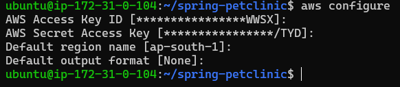
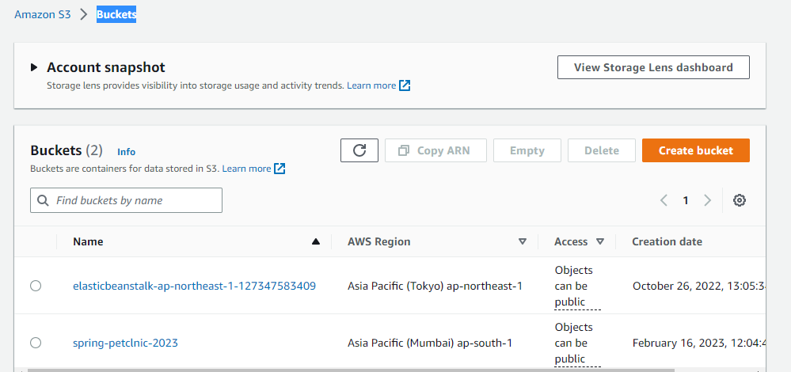

Springpetclinic applicaion
--------------------------
* Manual steps
```
sudo apt update
sudo apt install openjdk-17-jdk -y
sudo apt install maven -y
git clone https://github.com/spring-projects/spring-petclinic.git
cd spring-petclinic
./mvnw package
```
* Install aws cli  
  [Referhere](https://docs.aws.amazon.com/cli/latest/userguide/getting-started-install.html)
```
sudo apt install unzip -y
curl "https://awscli.amazonaws.com/awscli-exe-linux-x86_64.zip" -o "awscliv2.zip"
unzip awscliv2.zip
sudo ./aws/install
```
* create AMI user and AWS configuration
  
  
* push the package jar file at S3 Bucket
  [referhere](https://qiita.com/alokrawat050/items/56820afdb6968deec6a2)
  ```
   aws s3 mb s3://springpetclinic
   aws s3 cp /home/ubuntu/spring-petclinic s3://spring-petclnic-2023 --grants read=uri=http://acs.amazonaws.com/groups/global/AllUsers --recursive 

  ```
  

  Then login to another instance its extract the jar package
  ```
  sudo apt install openjdk-17-jdk
  wget https://spring-petclnic-2023.s3.ap-south-1.amazonaws.com/target/spring-petclinic-3.0.0-SNAPSHOT.jar
  ``` 
  * Write service file for spring petclinic
  ```
  cd /etc/sysyemd/system
  sudo vi spc.service
  ```
  ```yaml
  [Unit]
  Description=java spring petclinic
  [Service]
  User=ubuntu
  WorkingDirectory=/home/ubuntu/
  ExecStart=java -jar spring-petclinic-3.0.0-SNAPSHOT.jar
  Restart=on-failure
  RestartSec=5
  
  [Install]
  WantedBy=multi-user.target
  ```
  ```
  sudo systemctl daemon-reload
  sudo systemctl restart spc.service
  sudo systemctl status spc.service
  ```
